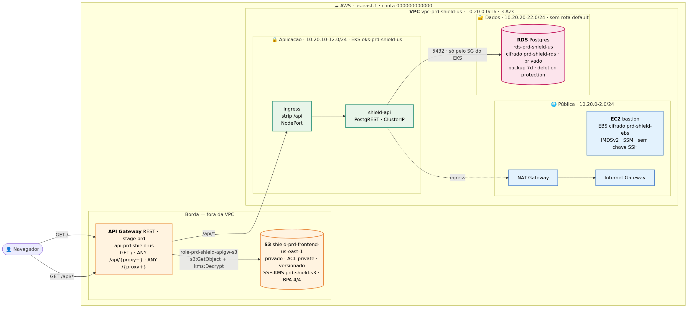
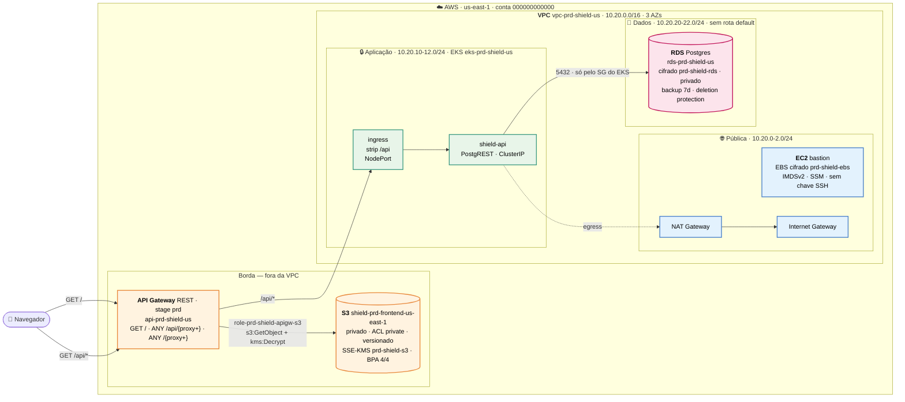
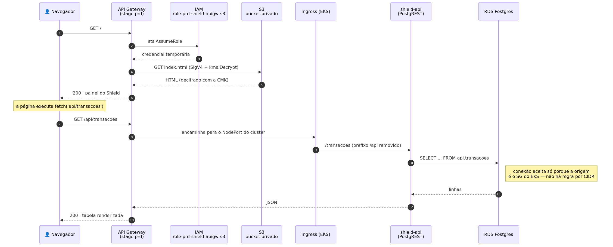
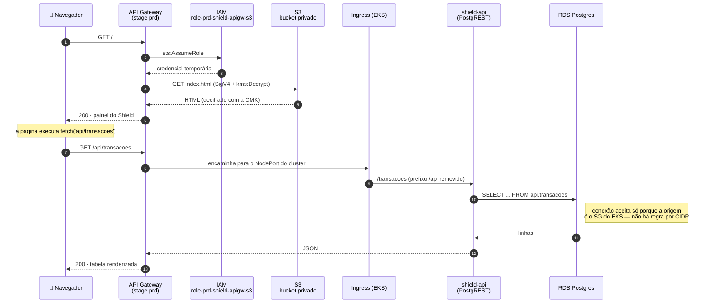

# Shield — plataforma antifraude em AWS emulada

Estudo de caso completo: uma aplicação de verdade (frontend + API + banco) sobre uma
fundação AWS construída com as práticas que uma auditoria esperaria encontrar —
rede em três camadas e três AZs, KMS por domínio de dado, IAM por função,
tags em tudo e bucket privado atrás do API Gateway.

> Pré-requisito: emulador no ar via Docker Compose — ver `README.md`.
> O console web sobe junto em **http://localhost:4500**: deixe aberto para ver
> os recursos aparecendo conforme você executa os passos.

## O produto

**Shield** é uma plataforma fictícia de antifraude de pagamentos. O painel lista
transações com score de risco; os dados vêm de um Postgres na camada privada,
servidos por uma API dentro do EKS, e a página em si é um objeto num bucket S3
privado. Nada disso é acessível diretamente: a única porta de entrada é o API Gateway.

```bash
make lab     # sobe tudo e valida (~3 min do zero)
make open    # abre o painel do Shield no navegador
```

---

## Arquitetura



<details><summary>fonte mermaid do diagrama</summary>



</details>

**Por que as camadas são três e não duas.** Separar "app" de "dados" parece
excesso até o primeiro incidente: se o EKS e o RDS dividem route table e NACL,
um pod comprometido tem o mesmo caminho de rede que a aplicação legítima. Com a
camada de dados isolada — **sem rota default nenhuma** — o banco não alcança a
internet nem para baixar pacote, e qualquer exfiltração precisa passar pela
camada de aplicação, onde há log e controle.

**Por que três AZs.** RDS e EKS exigem subnets em múltiplas AZs para failover.
Com uma AZ só, não existe alta disponibilidade — existe uma ilusão dela.

---

## O fluxo da integração S3 + API Gateway

O pedido central do estudo: servir um frontend estático do S3 **sem tornar o
bucket público**. O API Gateway é quem tem permissão de ler o bucket; o usuário
nunca fala com o S3.



<details><summary>fonte mermaid do diagrama</summary>



</details>

### Rotas configuradas

| Método | Caminho | Integração | Destino |
|---|---|---|---|
| `GET` | `/` | `HTTP_PROXY` | `s3://shield-prd-frontend-us-east-1/index.html` |
| `ANY` | `/api/{proxy+}` | `HTTP_PROXY` | ingress do EKS → `shield-api` |
| `ANY` | `/{proxy+}` | `HTTP_PROXY` | `s3://shield-prd-frontend-us-east-1/{proxy}` |

A ordem importa: `/api/{proxy+}` é mais específica que `/{proxy+}` e por isso
vence o roteamento. Se fosse o contrário, toda chamada de API voltaria como HTML
do bucket. O `make test` verifica exatamente isso.

### O que mantém o bucket fechado

| Controle | Efeito |
|---|---|
| Block Public Access (4 flags) | Nenhum objeto vira público, nem por ACL nem por policy |
| ACL `private` | Sem concessão a `AllUsers` / `AuthenticatedUsers` |
| Bucket policy | `s3:GetObject` só para `role-prd-shield-apigw-s3` |
| Bucket policy (deny) | Nega qualquer operação com `aws:SecureTransport=false` |
| SSE-KMS + Bucket Key | Cifrado com a CMK do time; ler exige `kms:Decrypt` |
| Versionamento | Deploy ruim do frontend se desfaz sem restore |

Repare que a role do API Gateway precisa de **duas** permissões: `s3:GetObject`
*e* `kms:Decrypt` na chave. Esquecer a segunda é o erro mais comum nesse
desenho — o objeto existe, a policy do bucket permite, e mesmo assim vem
`AccessDenied`.

---

## Convenção de nomes e tags

Todo recurso segue `<tipo>-<ambiente>-<produto>-<escopo>`:

```
vpc-prd-shield-us              eks-prd-shield-us          rds-prd-shield-us
snet-prd-shield-app-a          sg-prd-shield-rds          alias/prd-shield-s3
role-prd-shield-apigw-s3       api-prd-shield-us          shield-prd-frontend-us-east-1
```

E toda peça carrega as mesmas seis tags, o que sustenta billing por centro de
custo, inventário e políticas de acesso baseadas em tag:

```
Name · Environment=prd · Project=shield · Owner=squad-pagamentos
CostCenter=CC-4471 · Compliance=pci-dss · ManagedBy=floci-lab
```

As subnets ganham ainda `kubernetes.io/role/elb` (pública) e
`kubernetes.io/role/internal-elb` (app) — é por essas tags que o EKS descobre
onde criar load balancers.

---

## Receita manual

O `make provision` executa exatamente esta sequência. Vale percorrer à mão pelo
menos uma vez: é ela que ensina o *porquê* de cada peça.

```bash
eval "$(make -s env)"    # endpoint + credenciais + KUBECONFIG isolado
```

### 1. KMS — uma chave por domínio de dado

Uma CMK só para tudo é cômodo e errado: quem pode decifrar o backup do banco
passa a poder decifrar o frontend. Chaves separadas permitem policies separadas.

```bash
for dominio in ebs rds s3; do
  KID=$(aws kms create-key --description "Shield $dominio" \
        --tags TagKey=Name,TagValue=prd-shield-$dominio TagKey=Project,TagValue=shield \
        --query 'KeyMetadata.KeyId' --output text)
  aws kms create-alias --alias-name alias/prd-shield-$dominio --target-key-id $KID
  aws kms enable-key-rotation --key-id $KID       # rotação anual: CIS / PCI-DSS
done
```

> O KMS usa `TagKey=`/`TagValue=`, não `Key=`/`Value=` como o resto da CLI.

Criptografia de EBS ligada por padrão **na conta**, apontando para a chave do time:

```bash
EBS_KEY=$(aws kms describe-key --key-id alias/prd-shield-ebs --query 'KeyMetadata.Arn' --output text)
aws ec2 enable-ebs-encryption-by-default
aws ec2 modify-ebs-default-kms-key-id --kms-key-id $EBS_KEY
```

**Teste:**
```bash
aws ec2 get-ebs-encryption-by-default
aws ec2 get-ebs-default-kms-key-id
aws kms get-key-rotation-status --key-id alias/prd-shield-rds
```

### 2. IAM — uma role por função

```bash
aws iam create-role --role-name role-prd-shield-apigw-s3 \
  --assume-role-policy-document '{"Version":"2012-10-17","Statement":[{
    "Effect":"Allow","Principal":{"Service":"apigateway.amazonaws.com"},
    "Action":"sts:AssumeRole"}]}'

# permissão mínima: ler o bucket do frontend e decifrar com a CMK daquele bucket
aws iam put-role-policy --role-name role-prd-shield-apigw-s3 \
  --policy-name apigw-frontend-read --policy-document "{
    \"Version\":\"2012-10-17\",\"Statement\":[
      {\"Effect\":\"Allow\",\"Action\":[\"s3:GetObject\"],
       \"Resource\":\"arn:aws:s3:::shield-prd-frontend-us-east-1/*\"},
      {\"Effect\":\"Allow\",\"Action\":[\"kms:Decrypt\"],\"Resource\":\"$S3_KEY\"}]}"
```

O bastion não recebe chave SSH: o acesso é por Session Manager, que deixa
rastro no CloudTrail e dispensa porta 22 aberta.

**Teste:**
```bash
aws iam get-role-policy --role-name role-prd-shield-apigw-s3 --policy-name apigw-frontend-read
aws iam get-instance-profile --instance-profile-name instprof-prd-shield-bastion
```

### 3. Rede — 3 AZs × 3 camadas

```bash
VPC_ID=$(aws ec2 create-vpc --cidr-block 10.20.0.0/16 \
  --tag-specifications 'ResourceType=vpc,Tags=[{Key=Name,Value=vpc-prd-shield-us},{Key=Project,Value=shield}]' \
  --query 'Vpc.VpcId' --output text)
aws ec2 modify-vpc-attribute --vpc-id $VPC_ID --enable-dns-hostnames

# 9 subnets: 3 camadas × 3 AZs (ver scripts/lib/net.sh para o laço completo)
aws ec2 create-subnet --vpc-id $VPC_ID --cidr-block 10.20.0.0/24  --availability-zone us-east-1a \
  --tag-specifications 'ResourceType=subnet,Tags=[{Key=Name,Value=snet-prd-shield-pub-a},{Key=kubernetes.io/role/elb,Value=1}]'
```

Três route tables com propósitos distintos:

```bash
# pública  → Internet Gateway
aws ec2 create-route --route-table-id $RTB_PUBLIC  --destination-cidr-block 0.0.0.0/0 --gateway-id $IGW_ID
# app      → NAT Gateway (sai, mas não recebe)
aws ec2 create-route --route-table-id $RTB_PRIVATE --destination-cidr-block 0.0.0.0/0 --nat-gateway-id $NAT_ID
# dados    → nenhuma rota default, de propósito
```

Security groups liberando **por identidade**, nunca por CIDR:

```bash
aws ec2 authorize-security-group-ingress --group-id $SG_RDS \
  --protocol tcp --port 5432 --source-group $SG_EKS
```

`--source-group` sobrevive a mudança de CIDR, a novo node, a re-escalonamento de
pod. Uma regra `--cidr 10.20.10.0/24` quebra no dia em que a subnet muda — e,
pior, libera qualquer coisa que venha a ocupar aquele range.

**Teste:**
```bash
aws ec2 describe-subnets --filters "Name=vpc-id,Values=$VPC_ID" --query 'length(Subnets)'   # 9
aws ec2 describe-route-tables --route-table-ids $RTB_DATA \
  --query "length(RouteTables[0].Routes[?DestinationCidrBlock=='0.0.0.0/0'])"               # 0
aws ec2 describe-security-groups --group-ids $SG_RDS \
  --query "length(SecurityGroups[0].IpPermissions[?length(IpRanges)>\`0\`])"                # 0
```

### 4. EC2 bastion com volume cifrado

```bash
aws ec2 run-instances --image-id ami-00000001 --instance-type t3.micro --count 1 \
  --subnet-id $SUBNET_PUB_A --security-group-ids $SG_BASTION \
  --iam-instance-profile Name=instprof-prd-shield-bastion \
  --block-device-mappings "[{\"DeviceName\":\"/dev/xvda\",\"Ebs\":{
      \"VolumeSize\":20,\"VolumeType\":\"gp3\",\"Encrypted\":true,\"KmsKeyId\":\"$EBS_KEY\"}}]" \
  --metadata-options HttpTokens=required,HttpEndpoint=enabled \
  --tag-specifications 'ResourceType=instance,Tags=[{Key=Name,Value=ec2-prd-shield-bastion-1a}]'
```

`HttpTokens=required` força IMDSv2 — é o que impede que um SSRF na aplicação
leia as credenciais da instância pelo metadata service.

### 5. RDS na camada de dados

```bash
aws rds create-db-subnet-group --db-subnet-group-name dbsng-prd-shield-us \
  --db-subnet-group-description "Camada de dados do Shield" \
  --subnet-ids $SUBNET_DATA_A $SUBNET_DATA_B $SUBNET_DATA_C

aws rds create-db-instance --db-instance-identifier rds-prd-shield-us \
  --db-instance-class db.t3.micro --engine postgres --db-name shielddb \
  --master-username shield_app --master-user-password '...' \
  --allocated-storage 20 --storage-type gp3 \
  --storage-encrypted --kms-key-id $RDS_KEY \
  --db-subnet-group-name dbsng-prd-shield-us \
  --vpc-security-group-ids $SG_RDS \
  --no-publicly-accessible --backup-retention-period 7 \
  --copy-tags-to-snapshot --deletion-protection
```

**Sem o `--db-subnet-group-name` o RDS cai no grupo default da VPC default** e
todo o desenho de rede vira decoração. É o erro silencioso mais caro desta lista.

**Teste:**
```bash
aws rds describe-db-instances --db-instance-identifier rds-prd-shield-us \
  --query 'DBInstances[0].[StorageEncrypted,PubliclyAccessible,DBSubnetGroup.DBSubnetGroupName]'
```

### 6. EKS nas subnets de aplicação

```bash
aws eks create-cluster --name eks-prd-shield-us \
  --role-arn arn:aws:iam::000000000000:role/role-prd-shield-eks-cluster \
  --kubernetes-version 1.31 \
  --resources-vpc-config "subnetIds=$APP_A,$APP_B,$APP_C,securityGroupIds=$SG_EKS,endpointPublicAccess=false,endpointPrivateAccess=true" \
  --encryption-config 'resources=secrets,provider={keyArn='$EBS_KEY'}' \
  --tags Name=eks-prd-shield-us,Project=shield,CostCenter=CC-4471
```

Configure o `kubectl` — **não use `aws eks update-kubeconfig`**, ver
[Limitações](#limitações-do-emulador):

```bash
docker exec floci-eks-eks-prd-shield-us cat /etc/rancher/k3s/k3s.yaml > .lab/kubeconfig
sed -i "s|https://127.0.0.1:6443|https://localhost:$(docker port floci-eks-eks-prd-shield-us 6443/tcp | cut -d: -f2)|" .lab/kubeconfig
export KUBECONFIG=$PWD/.lab/kubeconfig
kubectl get nodes
```

### 7. Bucket privado do frontend

```bash
aws s3api create-bucket --bucket shield-prd-frontend-us-east-1

aws s3api put-bucket-encryption --bucket shield-prd-frontend-us-east-1 \
  --server-side-encryption-configuration "{\"Rules\":[{
    \"ApplyServerSideEncryptionByDefault\":{\"SSEAlgorithm\":\"aws:kms\",\"KMSMasterKeyID\":\"$S3_KEY\"},
    \"BucketKeyEnabled\":true}]}"

aws s3api put-bucket-ownership-controls --bucket shield-prd-frontend-us-east-1 \
  --ownership-controls 'Rules=[{ObjectOwnership=BucketOwnerPreferred}]'
aws s3api put-bucket-acl --bucket shield-prd-frontend-us-east-1 --acl private

aws s3api put-public-access-block --bucket shield-prd-frontend-us-east-1 \
  --public-access-block-configuration \
    BlockPublicAcls=true,IgnorePublicAcls=true,BlockPublicPolicy=true,RestrictPublicBuckets=true

aws s3api put-bucket-versioning --bucket shield-prd-frontend-us-east-1 \
  --versioning-configuration Status=Enabled

aws s3api put-object --bucket shield-prd-frontend-us-east-1 \
  --key index.html --body frontend/index.html \
  --content-type "text/html; charset=utf-8" --acl private
```

> **ACL vs. policy.** Com `ObjectOwnership=BucketOwnerEnforced` as ACLs ficam
> desativadas e o acesso passa a ser só por policy — é a recomendação atual da
> AWS. Aqui usamos `BucketOwnerPreferred` justamente para a ACL continuar
> existindo e poder ser inspecionada (`get-bucket-acl`) no laboratório.

**Teste:**
```bash
aws s3api get-public-access-block --bucket shield-prd-frontend-us-east-1
aws s3api get-bucket-acl --bucket shield-prd-frontend-us-east-1 \
  --query "Grants[?Grantee.URI!=null]"     # deve vir vazio
```

### 8. API Gateway como porta única

```bash
API=$(aws apigateway create-rest-api --name api-prd-shield-us --query id --output text)
ROOT=$(aws apigateway get-resources --rest-api-id $API --query "items[?path=='/'].id|[0]" --output text)

# GET / -> index.html do bucket
aws apigateway put-method --rest-api-id $API --resource-id $ROOT --http-method GET --authorization-type NONE
aws apigateway put-integration --rest-api-id $API --resource-id $ROOT --http-method GET \
  --type HTTP_PROXY --integration-http-method GET \
  --uri "http://floci:4566/shield-prd-frontend-us-east-1/index.html"

# ANY /api/{proxy+} -> ingress do EKS  (declarar ANTES do catch-all)
R_API=$(aws apigateway create-resource --rest-api-id $API --parent-id $ROOT --path-part api --query id --output text)
R_PX=$(aws apigateway create-resource --rest-api-id $API --parent-id $R_API --path-part '{proxy+}' --query id --output text)
aws apigateway put-method --rest-api-id $API --resource-id $R_PX --http-method ANY \
  --authorization-type NONE --request-parameters 'method.request.path.proxy=true'
aws apigateway put-integration --rest-api-id $API --resource-id $R_PX --http-method ANY \
  --type HTTP_PROXY --integration-http-method ANY \
  --uri "http://floci-eks-eks-prd-shield-us:30300/{proxy}" \
  --request-parameters 'integration.request.path.proxy=method.request.path.proxy'

aws apigateway create-deployment --rest-api-id $API --stage-name prd
```

**Teste — o fluxo inteiro:**
```bash
BASE=http://localhost:4566/restapis/$API/prd/_user_request_
curl -s $BASE/                    | head -3      # HTML do S3
curl -s $BASE/api/transacoes      | head -3      # JSON do RDS, via EKS
curl -s "$BASE/api/transacoes?status=eq.bloqueada&select=merchant"
```

Equivalente pronto: `make flow`.

---

## Comandos do dia a dia

| Alvo | O que faz |
|---|---|
| `make lab` | Sobe, provisiona e valida tudo (~3 min do zero) |
| `make open` / `make url` | Abre / imprime a URL da aplicação |
| `make ui` | Console web do emulador (http://localhost:4500) |
| `make test` | 50+ validações: KMS, IAM, rede, tags, ACL e fluxo |
| `make flow` | Só o teste ponta a ponta |
| `make psql` | Shell psql no RDS |
| `make seed` | Recria schema e dados de exemplo |
| `make backend` / `make frontend` | Reimplanta uma camada só |
| `make status` | Inventário do ambiente |
| `make destroy` / `make clean` | Remove recursos / derruba tudo |

---

## Perguntas de estudo mapeadas a cada etapa

**KMS (etapa 1)**
- Por que uma CMK por domínio em vez de uma chave só para a conta inteira?
- O que acontece com os snapshots existentes quando você troca a chave padrão de EBS?
- Por que a role do API Gateway precisa de `kms:Decrypt` além de `s3:GetObject`?

**IAM (etapa 2)**
- Qual a diferença entre policy inline e managed, e quando cada uma é preferível?
- Como o pod do EKS acessaria o Secrets Manager sem credencial estática? (IRSA)
- Por que instance profile em vez de gravar uma access key na instância?

**Rede (etapa 3)**
- Por que `--source-group` em vez de `--cidr` no SG do banco?
- O que muda no blast radius se a camada de dados tiver rota para o NAT?
- Onde uma NACL atuaria que o security group não atua?
- Este laboratório tem **um** NAT Gateway. O que quebra quando a AZ dele cai?

**EC2 (etapa 4)**
- Como `HttpTokens=required` (IMDSv2) bloqueia a exploração de um SSRF?
- Por que o bastion não tem chave SSH neste desenho?

**RDS (etapa 5)**
- O que acontece se o `--db-subnet-group-name` for omitido?
- Por que `--deletion-protection` e `--copy-tags-to-snapshot` importam em produção?

**EKS (etapa 6)**
- Para que servem as tags `kubernetes.io/role/elb` nas subnets?
- Por que `endpointPublicAccess=false` muda o modelo de acesso do time?

**S3 + API Gateway (etapas 7 e 8)**
- Por que servir o frontend pelo API Gateway em vez de deixar o bucket público?
- Em produção real, o que CloudFront + OAC resolveria melhor que este desenho?
- Como a ordem de declaração das rotas afeta `/api/*` vs. `/{proxy+}`?

---

## Limitações do emulador

O laboratório existe para treinar raciocínio de arquitetura, não para provar
paridade com a AWS. Estas divergências foram observadas e testadas aqui:

| Área | Divergência |
|---|---|
| **Isolamento de rede** | Subnets, route tables e SGs são objetos de control-plane. Todos os containers ficam na mesma bridge do Docker: o pod alcança o RDS pela rede plana, **não** porque o SG permitiu. |
| **Bucket policy / BPA** | O objeto continua legível anonimamente em `http://localhost:4566/<bucket>/<key>`, apesar de Block Public Access e da policy restritiva. O `make test` reporta isso como aviso, não como falha. |
| **API Gateway `--type AWS`** | A integração nativa com S3 (`arn:aws:apigateway:...:s3:path/...`) não é implementada — responde `MissingAction`. Por isso o laboratório usa `HTTP_PROXY`. |
| **API Gateway `--credentials`** | Aceito na chamada, mas não persistido: `get-integration` devolve `null`. A role existe e é testável, mas não é ela que autentica a leitura do bucket aqui. |
| **API Gateway `{proxy}` aninhado** | Em `/api/{proxy+}`, o Floci substitui `{proxy}` pelo caminho **completo** (`api/transacoes`), não pelo trecho após o prefixo como a AWS faz. O ingress no cluster remove o prefixo, o que faz a rota funcionar igual nos dois mundos. |
| **EKS `--encryption-config`** | Aceito, mas `describe-cluster` devolve `encryptionConfig: null`. A criptografia de secrets do etcd não é emulada. |
| **`aws eks update-kubeconfig`** | Gera um contexto que não autentica no k3s (401) e ainda troca o seu `current-context`. Use o kubeconfig interno do k3s. |
| **Containers reais** | EC2, RDS e EKS sobem containers de verdade (sshd, Postgres, k3s) — o comportamento de processo é fiel; a topologia de rede entre eles, não. |

Em conversa de estudo, a formulação honesta é: *"simulei esse fluxo localmente,
entendo o porquê de cada controle e sei quais deles o emulador não chega a
aplicar de fato"*.
