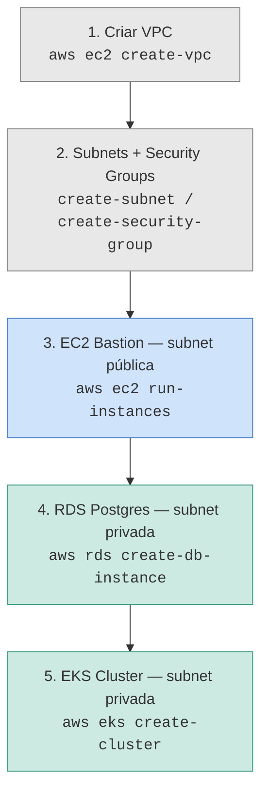

# Cenário de estudo: VPC + EC2 + RDS + EKS no Floci

Laboratório prático inspirado em perguntas estado de estudo do tipo "scenario-based" sobre AWS (VPC, EC2, IAM). O objetivo é construir, passo a passo, uma arquitetura de duas camadas (subnet pública + privada) e entender **por que** cada peça existe, não só como criá-la.

> Pré-requisito: Floci rodando via Docker Compose (`http://localhost:4566`) — ver `README.md` de setup do ambiente.

## Arquitetura alvo

```
                        ┌────────────────────────────┐
                        │   Você (AWS CLI / kubectl)  │
                        └──────────────┬─────────────┘
                                       │ Internet Gateway
                        ┌──────────────▼─────────────────────────┐
                        │           VPC 10.0.0.0/16               │
                        │  (ambiente emulado pelo Floci)          │
                        │                                          │
                        │  ┌───────────────────┐ ┌───────────────┐│
                        │  │ Subnet pública     │ │ Subnet privada││
                        │  │ 10.0.1.0/24        │ │ 10.0.2.0/24   ││
                        │  │                    │ │               ││
                        │  │ • Bastion EC2 (SSH)│ │ • EKS (k3s)   ││
                        │  │ • NAT Gateway      │ │ • RDS Postgres││
                        │  │ SG: 22 só do seu IP│ │ SG: só do     ││
                        │  │                    │ │   Bastion/EKS ││
                        │  └───────────────────┘ └───────────────┘│
                        └──────────────────────────────────────────┘
```

## Fluxo de construção



**Por que essa ordem importa:** cada recurso depende do anterior existir primeiro (subnet precisa de VPC, instância precisa de subnet + SG, RDS/EKS precisam do SG restrito criado no passo 2). É a mesma lógica de dependência que a AWS real exige via CloudFormation/Terraform.

---

## Receita: subindo o ambiente

### 0. Variáveis de ambiente

```bash
export AWS_ENDPOINT_URL=http://localhost:4566
export AWS_DEFAULT_REGION=us-east-1
export AWS_ACCESS_KEY_ID=test
export AWS_SECRET_ACCESS_KEY=test
```

### 1. Criar a VPC

```bash
VPC_ID=$(aws ec2 create-vpc --cidr-block 10.0.0.0/16 --query 'Vpc.VpcId' --output text)
echo "VPC criada: $VPC_ID"
```

**Teste:**
```bash
aws ec2 describe-vpcs --vpc-ids $VPC_ID
```

### 2. Criar subnets e security groups

```bash
# Subnet pública (bastion)
PUB_SUBNET=$(aws ec2 create-subnet --vpc-id $VPC_ID --cidr-block 10.0.1.0/24 \
  --availability-zone us-east-1a --query 'Subnet.SubnetId' --output text)

# Subnet privada (RDS + EKS)
PRIV_SUBNET=$(aws ec2 create-subnet --vpc-id $VPC_ID --cidr-block 10.0.2.0/24 \
  --availability-zone us-east-1a --query 'Subnet.SubnetId' --output text)

# SG do bastion: só SSH de fora
BASTION_SG=$(aws ec2 create-security-group --group-name bastion-sg \
  --description "bastion" --vpc-id $VPC_ID --query 'GroupId' --output text)
aws ec2 authorize-security-group-ingress --group-id $BASTION_SG \
  --protocol tcp --port 22 --cidr 0.0.0.0/0

# SG da subnet privada: só aceita tráfego vindo do bastion
PRIVATE_SG=$(aws ec2 create-security-group --group-name private-sg \
  --description "private" --vpc-id $VPC_ID --query 'GroupId' --output text)
aws ec2 authorize-security-group-ingress --group-id $PRIVATE_SG \
  --protocol tcp --port 22 --source-group $BASTION_SG

echo "Subnet pública: $PUB_SUBNET | Subnet privada: $PRIV_SUBNET"
echo "SG bastion: $BASTION_SG | SG privado: $PRIVATE_SG"
```

**Teste:**
```bash
aws ec2 describe-subnets --filters "Name=vpc-id,Values=$VPC_ID"
aws ec2 describe-security-groups --group-ids $BASTION_SG $PRIVATE_SG
```

### 3. Lançar o EC2 bastion

```bash
INSTANCE_ID=$(aws ec2 run-instances --image-id ami-00000001 --count 1 \
  --instance-type t3.micro --subnet-id $PUB_SUBNET \
  --security-group-ids $BASTION_SG \
  --query 'Instances[0].InstanceId' --output text)

echo "Instância bastion: $INSTANCE_ID"
```

**Teste:**
```bash
aws ec2 describe-instances --instance-ids $INSTANCE_ID \
  --query 'Reservations[0].Instances[0].[State.Name,SubnetId,SecurityGroups]'
```

### 4. Criar o RDS Postgres (container Docker real por trás)

```bash
aws rds create-db-instance \
  --db-instance-identifier meu-banco \
  --db-instance-class db.t3.micro \
  --engine postgres \
  --master-username admin --master-user-password senha123 \
  --allocated-storage 20 \
  --vpc-security-group-ids $PRIVATE_SG
```

**Teste — confirme que existe um container Docker real rodando:**
```bash
docker ps | grep postgres

aws rds describe-db-instances --db-instance-identifier meu-banco \
  --query 'DBInstances[0].[DBInstanceStatus,Endpoint]'
```

Conecte diretamente para validar (já que é Postgres de verdade):
```bash
ENDPOINT=$(aws rds describe-db-instances --db-instance-identifier meu-banco \
  --query 'DBInstances[0].Endpoint.Address' --output text)
PORT=$(aws rds describe-db-instances --db-instance-identifier meu-banco \
  --query 'DBInstances[0].Endpoint.Port' --output text)

psql "host=$ENDPOINT port=$PORT user=admin dbname=postgres" -c "SELECT version();"
```

### 5. Criar o cluster EKS (k3s real por trás)

```bash
aws eks create-cluster --name meu-cluster \
  --role-arn arn:aws:iam::000000000000:role/eks-role \
  --resources-vpc-config subnetIds=$PRIV_SUBNET
```

**Teste — aguarde o cluster ficar ativo e configure o kubectl:**
```bash
aws eks describe-cluster --name meu-cluster --query 'cluster.status'

aws eks update-kubeconfig --name meu-cluster --region us-east-1

kubectl get nodes
kubectl get pods -A
```

**Teste — confirme que existe um container k3s real rodando:**
```bash
docker ps | grep k3s
```

---

## Cenário de teste ponta a ponta

Depois que tudo estiver de pé, valide o fluxo completo: um pod dentro do EKS conseguindo falar com o RDS pela rede privada.

```bash
kubectl run pg-test --rm -it --image=postgres:16-alpine --restart=Never -- \
  psql "host=$ENDPOINT port=$PORT user=admin dbname=postgres" -c "SELECT 1;"
```

Se retornar `1`, o fluxo completo (EKS → SG → RDS) está funcionando de ponta a ponta.

---

## Perguntas estado de estudo mapeadas a cada etapa

**Sobre a VPC (etapa 1)**
- Por que segmentar em subnet pública e privada em vez de uma única subnet?
- O que acontece com os recursos se a VPC for deletada?

**Sobre subnets e security groups (etapa 2)**
- Qual a diferença entre Security Group e NACL, e onde cada um atuaria aqui?
- Por que usar `--source-group` em vez de liberar por CIDR no SG privado?

**Sobre o EC2 bastion (etapa 3)**
- Por que o bastion fica na subnet pública e os demais recursos não?
- Como você reduziria a superfície de ataque desse bastion (ex.: restringir `0.0.0.0/0` para o CIDR do seu escritório)?

**Sobre o RDS (etapa 4)**
- Por que o RDS não deveria ter IP público em um cenário real?
- O que muda se você remover a rota padrão (`0.0.0.0/0`) da tabela de rotas da subnet privada?

**Sobre o EKS (etapa 5)**
- Como o EKS autenticaria no RDS sem hardcodar senha no manifesto (dica: IAM Role for Service Accounts / IRSA)?
- O que aconteceria com os pods se a subnet privada perdesse a rota para um NAT Gateway?

---

## Limpeza do ambiente

```bash
aws eks delete-cluster --name meu-cluster
aws rds delete-db-instance --db-instance-identifier meu-banco --skip-final-snapshot
aws ec2 terminate-instances --instance-ids $INSTANCE_ID
aws ec2 delete-security-group --group-id $PRIVATE_SG
aws ec2 delete-security-group --group-id $BASTION_SG
aws ec2 delete-subnet --subnet-id $PRIV_SUBNET
aws ec2 delete-subnet --subnet-id $PUB_SUBNET
aws ec2 delete-vpc --vpc-id $VPC_ID
```

## Ressalva importante

VPC, subnets e route tables no Floci funcionam como objetos de control-plane (a API responde no formato certo), mas o isolamento de rede real entre eles pode não replicar 100% o roteamento de uma VPC AWS de verdade. RDS e EKS, por outro lado, sobem containers Docker reais (Postgres e k3s), então o comportamento desses dois é fiel ao mundo real. Em  estado de estudo, é mais seguro dizer "simulei esse fluxo localmente e entendo o porquê de cada peça" do que assumir paridade total de rede.